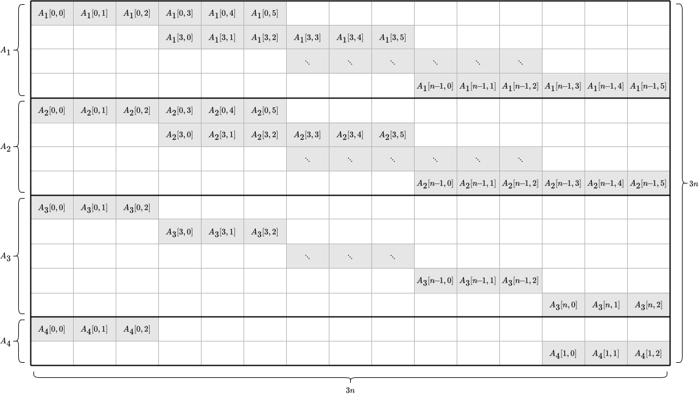
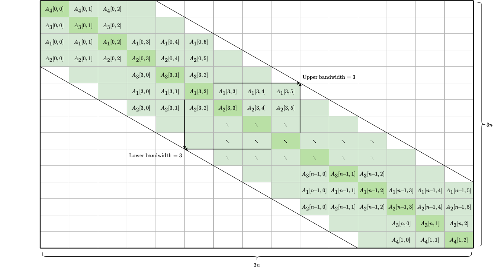
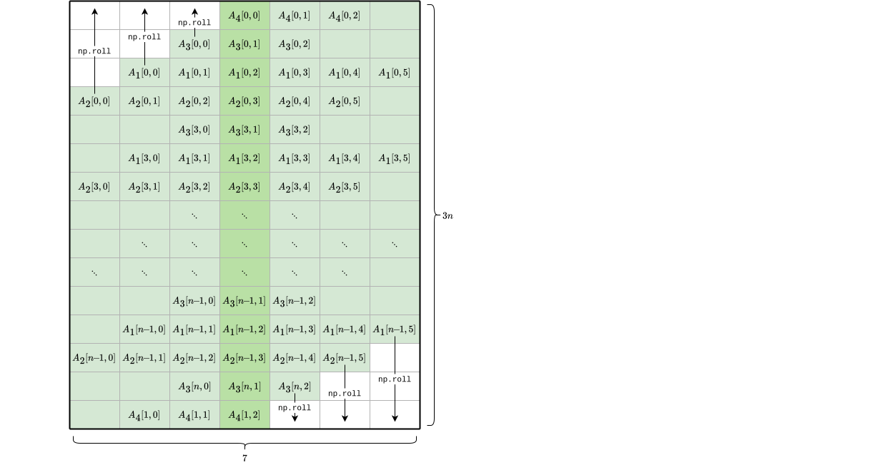
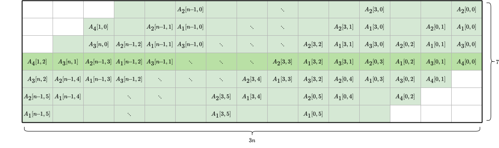

# It may be *Per$\!\!\:f\!\!\:$ec$[t]$*, but is it *Per$\!\!\:f\!\!\:$orman$[t]$*?

Yes; SignalPerfect is incredibly fast.

The instantiation of the `SpecialQuadraticSpline` class --- the creation of the special quadratic spline itself --- is the most computationally expensive code, compared to the methods of the class. Where $n$ is `len(k)` or `len(y) + 1`, `SpecialQuadraticSpline(k, y)` has a computational complexity of $O(n)$ rather than $O(n^3)$, thanks to the following linear algebra strategies with which `SpecialQuadraticSpline`'s constructor is implemented.

## Optimal ordering of the $A$ matrix to minimize its bandwidth

The four submatrices $A_1$, $A_2$, $A_3$, and $A_4$ from the [Derivation](derivation.md) must be combined into one matrix $A$ (and similarly the four subvectors $\mathbf{b}_1$, $\mathbf{b}_2$, $\mathbf{b}_3$, and $\mathbf{b}_4$) must be combined into one vector $\mathbf{b}$) in order to solve the unified linear system $A\mathbf{x}=\mathbf{b}$.

This can be done by simply stacking/concatenating the four $A$ submatrices (and similarly four $\mathbf{b}$ subvectors) as follows:

In the diagram, white-shaded cells are necessarily zero and gray-shaded cells may be nonzero (but will be referred to as nonzero cells for simplicity).

As can be seen, the first three $A$ submatrices are somewhat *banded* from their top-left to bottom-right cells, and as a result the stacked $A$ matrix has a few bands. Banded matrices are easier to work with (see both of the following sections), but the stacked $A$ matrix is not actually banded and would have to be treated as a square matrix for purposes of both storage and solving. Regarding storage, such a square matrix occupies a whopping $(3n)(3n)=9n^2$ floating-point addresses in memory, even though the overwhelming majority of cells are zero. And more importantly, *solving* a linear system whose $A$ matrix is in square format is extremely inefficient, with complexity $O(N^3)$.

Having an $A$ matrix that is not only sparse but also banded and with as narrow a *bandwidth* as possible is highly desirable. Such an $A$ matrix can be achieved using algorithms that permute (reorder) the rows and/or columns in an existing $A$ matrix. These algorithms often operate on symmetric matrices, but can be adapted to asymmetric matrices (such as ours). One algorithm is Alan George and Joseph Liu's Reverse Cuthill--McKee (RCM) algorithm, implemented by [`scipy.sparse.csgraph.reverse_cuthill_mckee`](https://docs.scipy.org/doc/scipy/reference/generated/scipy.sparse.csgraph.reverse_cuthill_mckee.html). The RCM algorithm builds upon the [original]((https://dl.acm.org/doi/10.1145/800195.805928)) one developed by Elizabeth Cuthill and James McKee. This field of research is well established, as evidenced by the Cuthill--McKee algorithm being published in the same year as the moon landing. However, the problem of minimizing a matrix's bandwidth is NP-hard and it should not be surprising that RCM performed poorly on our stacked $A$ matrix with a few thousand rows and columns, as small as that might be.

Knowing the patterned layout of our matrix, the above problem was solved by using a systematic approach to reorder our matrix's rows. This approach is faster, simpler, and guaranteed to be optimal for any $n$. It is illustrated with the following diagram, which shows the final order of the rows from the four $A$ submatrices:

In the diagram, the dark-green-shaded cells are the matrix's diagonal. Together with the light-green-shaded cells, the matrix's band is shown, with an upper and lower bandwidth of 3.

## Direct construction of the banded $A$ matrix in banded storage format

Consider the banded $A$ matrix from the previous section. Its zero cells can be removed and its nonzero cells can be shifted into a significantly smaller, non-square matrix of shape $7\times3n$:

As can be seen in the diagram, the $A$ matrix's band is now stored vertically, with its diagonal as the center column.

Such a format is often used for banded matrices to drastically reduce their memory footprint, and as a result linear algebra algorithms often operate on matrices in this format. Indeed, the to-be-used [`scipy.linalg.solve_banded`](https://docs.scipy.org/doc/scipy/reference/generated/scipy.linalg.solve_banded.html) function is no exception. However, constructing the square $A$ matrix and then converting to the required format would both defeat the purpose of reduced memory footprint and demand unnecessary additional computations for the conversion. Instead, `SpecialQuadraticSpline` constructs the $A$ matrix in the above format directly.

In the above diagram, the $i$ indices of each row's cell values are the same, so this format will be termed "row-major banded storage format", in contrast to "column-major banded storage format" of shape $3n\times7$ in which the $j$ values of each *column*'s cell values are the same. The row-major banded storage format is convenient to construct in our case, but [`scipy.linalg.solve_banded`](https://docs.scipy.org/doc/scipy/reference/generated/scipy.linalg.solve_banded.html) expects a matrix in the column-major banded storage format, so a computationally lightweight conversion is required: `SpecialQuadraticSpline` applies [`numpy.roll`](https://numpy.org/doc/stable/reference/generated/numpy.roll.html) as illustrated above and rotates the matrix by 90 degrees. This produces the column-major banded storage format, shown as follows:

## Using a linear solver optimized for a banded $A$ matrix

Where possible, using [`scipy.linalg.solve_banded`](https://docs.scipy.org/doc/scipy/reference/generated/scipy.linalg.solve_banded.html) instead of [`scipy.linalg.solve`](https://docs.scipy.org/doc/scipy/reference/generated/scipy.linalg.solve.html) or [`numpy.linalg.solve`](https://numpy.org/doc/stable/reference/generated/numpy.linalg.solve.html) is much more efficient, with a complexity of $O(n)$ instead of $O(n^3)$. And of course, using the column-major banded storage format, `SpecialQuadraticSpline` leverages this to solve for its spline's $3n$ parameters extremely quickly. In fact, this is the fastest part of `SpecialQuadraticSpline`'s instantiation.
